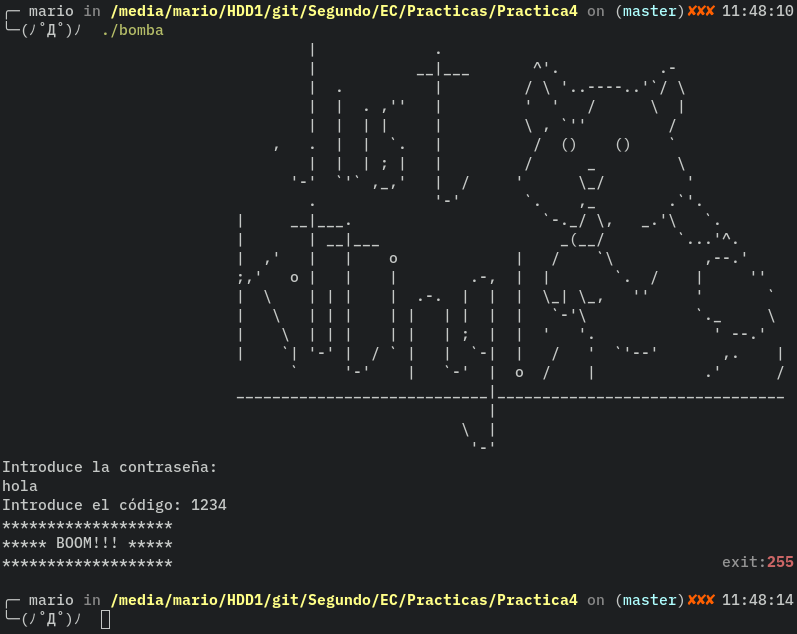
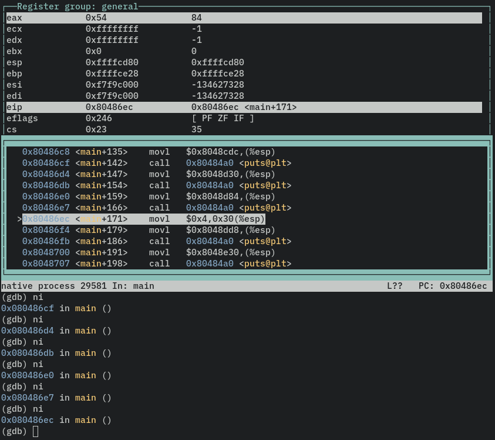
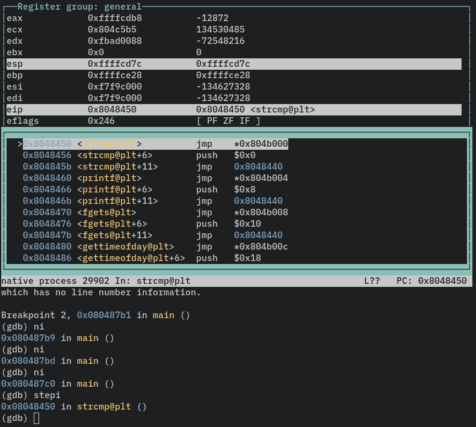
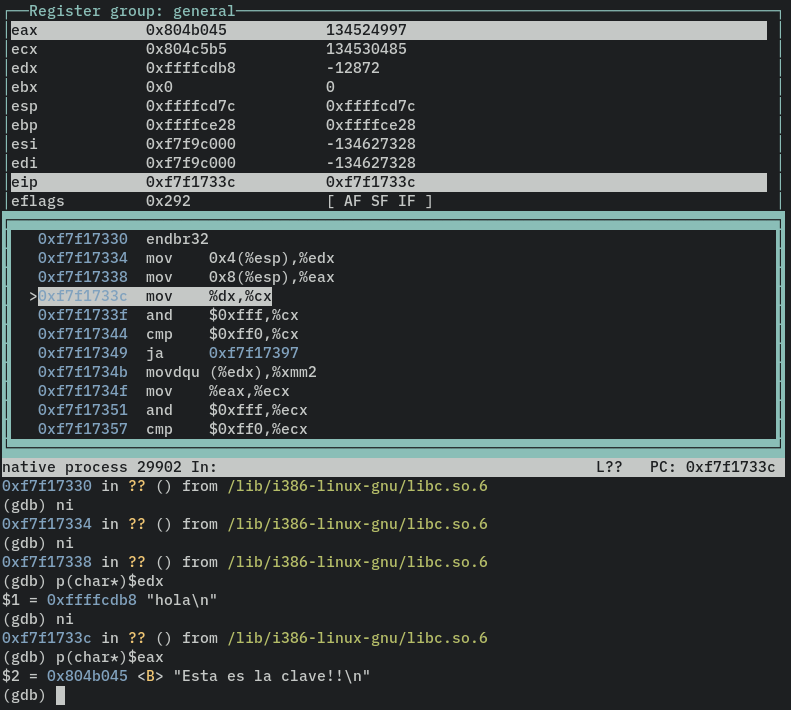
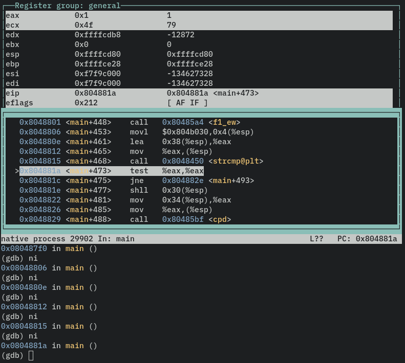
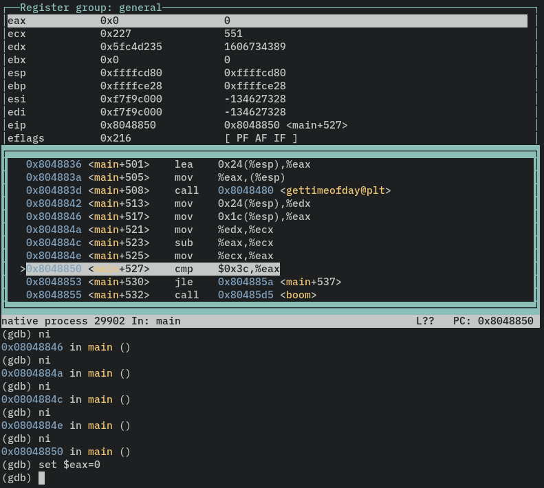
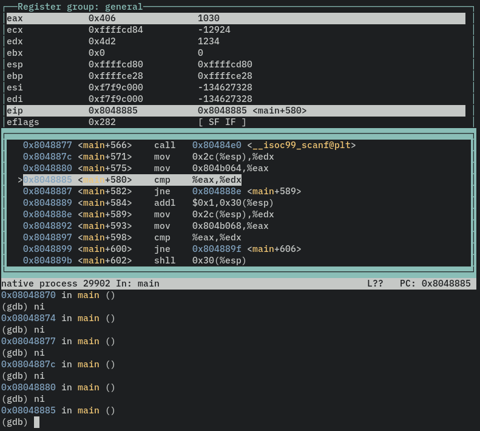
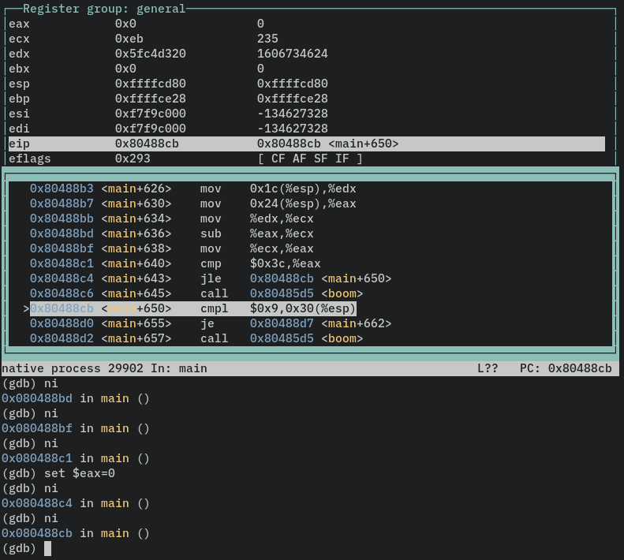
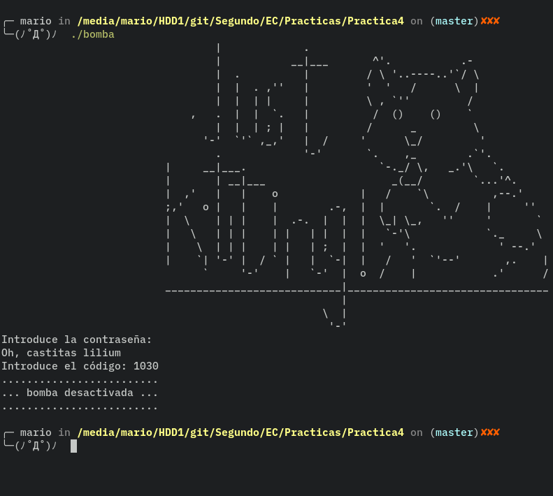

# Desactivación de la bomba NBA

### Hecho por Mario García Márquez

Esta práctica consiste en la desactivación y encontrar las claves de la bomba NBA. Se explicarán los pasos para hacerlo correctamente.

Empezaremos ejecutando el binario de forma habitual: 

Como podemos observar el programa empieza imprimiendo un logo al estilo ASCII-ART, nos solicita un una contraseña y un código. En nuestro caso la bomba ha explotado ya que los datos que hemos introducido son incorrectos.

Procedemos a depurar el programa usando la utilidad GDB. Procedemos a ejecutar el programa y lo primero que vemos en main es una fila de instrucciones que imprimen el ascii art pero entre ellas se encuentra una asignación: 

A esta le haremos caso más adelante pero nos conviene apuntar en que parte de la pila se encuentra el dato asignado.

Seguimos avanzando en la ejecución del programa hasta encontrarnos con una función que nos pide una entrada, es decir, la contraseña. Una vez ejecutada esta función nos paramos a ver las siguientes instrucciones.

Vemos entonces que nos esperan tres llamadas a strcmp, cada una con un salto a una parte distinta de main. Podemos meternos en cada uno de estos strcmp y ver con que string compara la nuestra. Solo mostraré el proceso para la primera de ellas, las demás son exactamente igual y siguen el método del tutorial.

Cuando lleguemos a la llamada de la función ejecutaremos la orden stepi que nos llevará al cuerpo de la función. 

Una vez allí avanzaremos hasta que podamos ver un salto ja. Cerca de esta instrucción podemos ver que se asignan datos de la pila a los registros edx y eax. Si miramos los datos que contienen estos registros como una cadena de char podemos ver nuestra cadena y con la que se compara, es decir, la posible contraseña. 

Mirando los saltos a donde van tras cada strcmp nos llama la atención que nuestro tercer strcmp hace un desplazamiento a la izquierda de nuestra variable que fue asignada durante el dibujo(reconocemos su dirección en la pila). 

Curiosamente en ningún momento escribir una contraseña inválida hace que la bomba explote. Lo que si hace que pueda explotar es la comprobación del tiempo que saltaremos poniendo el registro eax=0 en la orden correcta. 

Avanzamos por el programa hasta que nos pida el número. Introducimos uno que podemos identificar con facilidad. Podemos ver que es cotejado con otros dos números que podemos ver en el registro eax. 

Vemos que el resultado de esta comprobación hace que se modifique nuestra variable que "secreta". El primer valor, 1030, suma 1 a nuestra variable y el segundo, 5700, hace un desplazamiento hacia la izquierda de esta. 

Volvemos a pasar la comprobación del tiempo como hemos hecho antes y vemos una comprobación final. Si nuestra variable "secreta" vale 9 desactivaremos la bomba, de otra forma, explotará. 

Entonces observamos la naturaleza del programa, modificar la variable según los datos introducidos de forma que la combinación clave será aquella que haga que contenga el valor 9.

Volviendo a la asignación vemos que se le asigna el valor el 4, esto es en binario 10. Queremos obtener el valor 9, que es 101. Es fácil observar que con un desplazamiento a la izquierda y una suma posterior tendríamos el resultado deseado. Esto es, el tercer strcmp y y el primero número.

Comprobamos con estos datos y vemos que hemos acertado, por tanto, hemos logrado desactivar la bomba.